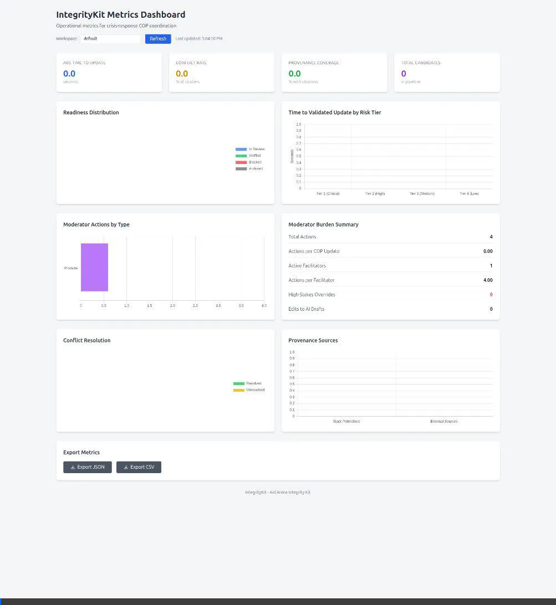
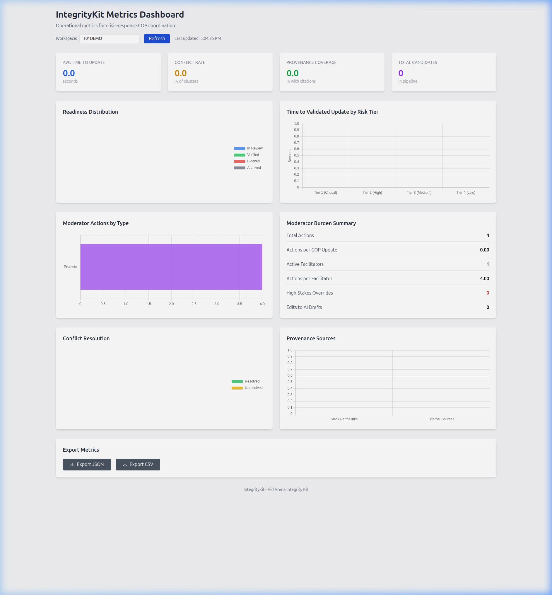

# Aid Arena Integrity Kit


An open-source coordination layer for crisis response that turns chaotic Slack messages into provenance-backed situational awareness updates — enabling collective verification, safer organizing, and faster, fairer decisions.

---

## Demo

> **Live walkthrough:** signals ingested → AI-clustered → promoted to candidate → readiness evaluated → COP draft generated → metrics dashboard updated.



### Dashboard (live data from T01DEMO workspace)



The Metrics Dashboard shows operational data for the active workspace:
- **Moderator Actions by Type** — bar chart of facilitator actions (Promote, Evaluate, Publish…)
- **Moderator Burden Summary** — total actions, active facilitators, actions per facilitator
- **Readiness Distribution** — donut chart of candidates by state (In Review / Verified / Blocked)
- **Conflict Resolution** — ratio of resolved vs. unresolved conflicting reports
- **Provenance Sources** — citation breakdown by type

---

## Overview

The Aid Arena Integrity Kit is a human-AI collaboration platform that helps crisis coordinators transform fast-moving Slack conversations into structured, citation-backed situational awareness updates. AI clusters related reports, surfaces corroborating evidence, and drafts publication-ready wording — while **humans perform all verification and validation**. Every claim links back to its source evidence, creating an auditable chain of trust from raw message to published update.

Unlike traditional emergency management tools that require participants to file forms or learn new interfaces, this system operates in **ambient mode**: general participants continue using Slack normally while a small team of facilitators uses AI-assisted tooling to produce accurate COP updates. The result is accountability without bureaucracy: full provenance and audit trails without slowing down response.

### What It Does

- Continuously ingests Slack messages from monitored channels
- Clusters related messages by topic/incident using LLM classification
- Detects duplicate reports and conflicting information
- Surfaces a prioritized backlog of clusters for facilitator review
- Provides a verification workflow with readiness gates for high-stakes information
- Generates draft COP updates with verification-aware wording in multiple languages (English, Spanish, French)
- Publishes provenance-backed updates (every claim links to source evidence)
- Exports to standard emergency management formats (CAP 1.2, EDXL-DE, GeoJSON)
- Integrates with external systems via webhooks and verified data sources
- Provides advanced analytics and after-action reporting
- Maintains full audit logging and role-based access control

### Who It's For

**Primary users:**
- Crisis response coordinators managing multi-channel Slack workspaces
- Emergency management teams running exercises or real-world incidents
- Mutual aid networks coordinating disaster response

**Key value proposition:**
- **Reduces information overload**: Facilitators review a curated, AI-prioritized backlog instead of scanning all channels
- **Increases accuracy**: Verification workflow and conflict detection catch errors before publication
- **Builds trust through transparency**: Every published claim links to source evidence — full provenance from raw Slack message to COP update, with immutable audit logs tracking every action
- **Keeps humans in control**: AI surfaces evidence and drafts wording; humans perform all verification and validation. No update goes out without explicit human approval

---

## Architecture Overview

```
┌─────────────────────────────────────────────────────────────────┐
│                         SLACK WORKSPACE                         │
│  #operations  #logistics  #medical  #shelter  #rumor-control    │
└───────────────────────────────┬─────────────────────────────────┘
                                │
                                │ Slack Events API
                                ▼
┌─────────────────────────────────────────────────────────────────┐
│                      SIGNAL INGESTION PIPELINE                  │
│  ┌──────────┐   ┌──────────┐   ┌────────────┐   ┌───────────┐ │
│  │  Slack   │──▶│  Store   │──▶│  Embed &   │──▶│  Cluster  │ │
│  │ Listener │   │ MongoDB  │   │  Index in  │   │  Related  │ │
│  │          │   │          │   │  ChromaDB  │   │  Signals  │ │
│  └──────────┘   └──────────┘   └────────────┘   └───────────┘ │
└─────────────────────────────────────────────────────────────────┘
                                │
                                ▼
┌─────────────────────────────────────────────────────────────────┐
│                  FACILITATOR WORKFLOW (PRIVATE)                 │
│                                                                 │
│  ┌────────────────────┐                                        │
│  │  COP BACKLOG       │  AI-prioritized clusters               │
│  │  ────────────────  │  awaiting promotion                    │
│  │  • Shelter Alpha   │                                        │
│  │    closure (5 msg) │                                        │
│  │  • Bridge damage   │                                        │
│  │    (8 msg) 🔴      │  🔴 = conflict detected                │
│  │  • Water advisory  │                                        │
│  │    (3 msg)         │                                        │
│  └────────┬───────────┘                                        │
│           │ Promote to Candidate                               │
│           ▼                                                     │
│  ┌────────────────────┐                                        │
│  │  COP CANDIDATES    │  Verification workflow                 │
│  │  ────────────────  │                                        │
│  │  ✅ Shelter Alpha  │  ✅ Ready - Verified                   │
│  │  🟨 Water advisory │  🟨 Ready - In Review                  │
│  │  🟥 Bridge damage  │  🟥 Blocked (conflict unresolved)      │
│  └────────┬───────────┘                                        │
│           │ Draft & Approve                                    │
│           ▼                                                     │
│  ┌────────────────────┐                                        │
│  │  COP UPDATE DRAFT  │  AI-generated with human edits         │
│  │  ────────────────  │                                        │
│  │  [VERIFIED]        │                                        │
│  │  Shelter Alpha...  │                                        │
│  │  (citations: ...)  │                                        │
│  │                    │                                        │
│  │  [IN REVIEW]       │                                        │
│  │  Unconfirmed: ...  │                                        │
│  └────────┬───────────┘                                        │
│           │ Publish                                            │
│           ▼                                                     │
└─────────────────────────────────────────────────────────────────┘
                                │
                                ▼
┌─────────────────────────────────────────────────────────────────┐
│                 PUBLISHED COP (PUBLIC CHANNEL)                  │
│  Posted to #cop-updates with full provenance and citations     │
└─────────────────────────────────────────────────────────────────┘
```

### Data Flow

1. **Signal Ingestion**: Slack messages flow continuously into MongoDB and are embedded in ChromaDB for semantic search
2. **Clustering**: LLM assigns each signal to topic/incident clusters based on content similarity
3. **Conflict Detection**: System flags contradictory information within clusters
4. **Backlog Prioritization**: Clusters ranked by urgency, impact, and risk scores
5. **Promotion to Candidates**: Facilitators promote important clusters to the COP candidate pipeline
6. **Readiness Evaluation**: System checks completeness (who/what/when/where/so-what/evidence) and verification status
7. **COP Drafting**: LLM generates publication-ready text with verification-aware wording (direct for verified, hedged for in-review)
8. **Human Approval**: Facilitators review, edit, and approve drafts
9. **Publication**: Versioned COP update posts to Slack with full citation links

---

## Quick Start

### Prerequisites

- Docker and Docker Compose (recommended)
- OpenAI API key
- (Optional) Slack workspace with bot token for live ingestion

### Run with Docker Compose

The fastest way to get started:

```bash
git clone https://github.com/ai4altruism/integritykit.git
cd integritykit

# Copy and fill in your credentials
cp demo/.env.demo .env
# Edit .env — at minimum set OPENAI_API_KEY

# Start all services (app + MongoDB + ChromaDB)
docker compose up -d

# Wait for the app to be healthy
curl http://localhost:8080/health
```

The application will be available at:

- **API**: http://localhost:8080
- **API Docs (Swagger)**: http://localhost:8080/docs
- **Metrics Dashboard**: http://localhost:8080/dashboard
- **Analytics Dashboard**: http://localhost:8080/analytics

### Run the Demo Scenario

Simulate a crisis event (bridge damage + shelter capacity reports) and walk through the full facilitator pipeline:

```bash
# Step 1: Inject simulated Slack messages and cluster them
docker exec integritykit-app python demo/simulate_scenario.py

# Step 2: Run the facilitator workflow (promote → evaluate → draft)
docker exec integritykit-app python demo/run_facilitator_demo.py

# Step 3: View live metrics
# Open http://localhost:8080/dashboard
# Type "T01DEMO" in the Workspace field and click Refresh
```

### Install for Development

```bash
python3.11 -m venv .venv
source .venv/bin/activate  # Windows: .venv\Scripts\activate
pip install -e ".[dev]"
```

---

## Configuration

### Environment Variables

| Variable | Required | Default | Description |
|----------|----------|---------|-------------|
| `OPENAI_API_KEY` | Yes | - | OpenAI API key for LLM operations |
| `SLACK_BOT_TOKEN` | Yes* | - | Slack bot user OAuth token (xoxb-...) |
| `SLACK_SIGNING_SECRET` | Yes* | - | Slack app signing secret |
| `SLACK_APP_TOKEN` | Yes* | - | Slack app-level token for Socket Mode |
| `MONGODB_URI` | Yes | - | MongoDB connection string |
| `MONGODB_DATABASE` | No | `integritykit` | MongoDB database name |
| `CHROMA_HOST` | No | `localhost` | ChromaDB server host |
| `CHROMA_PORT` | No | `8000` | ChromaDB server port |
| `ENVIRONMENT` | No | `development` | Environment (development / staging / production) |
| `LOG_LEVEL` | No | `INFO` | Logging level |
| `DATA_RETENTION_DAYS` | No | `90` | Signal retention period |
| `SUPPORTED_LANGUAGES` | No | `en` | COP languages: `en`, `es`, `fr` |
| `WEBHOOKS_ENABLED` | No | `false` | Enable outbound webhook notifications |
| `CAP_EXPORT_ENABLED` | No | `false` | Enable CAP 1.2 XML export |
| `GEOJSON_EXPORT_ENABLED` | No | `false` | Enable GeoJSON export |

*Required only for live Slack integration. The demo scenario runs without Slack credentials.

### Slack App Setup

1. Create a new Slack app at https://api.slack.com/apps
2. Enable Socket Mode and generate an App Token
3. Add Bot Token Scopes:
   - `channels:history`, `channels:read`, `chat:write`
   - `groups:history`, `users:read`
4. Subscribe to Events: `message.channels`, `message.groups`
5. Install the app to your workspace

### Role-Based Access Control

| Role | Permissions |
|------|-------------|
| `general_participant` | Read-only access to published COPs (default) |
| `verifier` | Record verification actions on candidates |
| `facilitator` | Full backlog and candidate management, COP publishing |
| `workspace_admin` | User/role management, system configuration |

---

## Security

IntegrityKit includes several security hardening features (v0.4.0+):

| Feature | Environment Variable | Default |
|---------|---------------------|---------|
| CORS | `CORS_ALLOWED_ORIGINS` | (empty) |
| Rate Limiting | `RATE_LIMIT_ENABLED` | `true` |
| Rate Limit Threshold | `RATE_LIMIT_REQUESTS_PER_MINUTE` | `60` |
| Two-Person Rule | `TWO_PERSON_RULE_ENABLED` | `true` |
| Abuse Detection | `ABUSE_DETECTION_ENABLED` | `true` |

Security headers included by default: `X-Frame-Options`, `X-Content-Type-Options`, `X-XSS-Protection`, `Content-Security-Policy`, `Referrer-Policy`.

---

## Project Structure

```
integritykit/
├── src/integritykit/
│   ├── api/                    # FastAPI routes
│   ├── llm/prompts/            # LLM prompt engineering
│   ├── models/                 # Pydantic models
│   ├── services/               # Business logic & database repositories
│   ├── slack/                  # Slack integration
│   └── static/                 # Dashboard HTML
├── demo/
│   ├── simulate_scenario.py    # Injects simulated crisis signals
│   ├── run_facilitator_demo.py # Automates the facilitator workflow
│   └── .env.demo               # Demo environment template
├── tests/
│   ├── unit/
│   ├── integration/
│   ├── e2e/
│   └── performance/
├── docs/
│   ├── media/                  # Screenshots and demo recordings
│   ├── cdd.md                  # Capability Description Document
│   ├── srs.md                  # System Requirements Specification
│   ├── architecture.md
│   ├── mongodb-schema.md
│   ├── api-guide.md
│   ├── analytics.md
│   ├── multi-language.md
│   └── openapi.yaml
├── docker-compose.yml
├── Dockerfile
└── pyproject.toml
```

---

## Development

### Code Style

```bash
ruff check --fix .    # Lint and auto-fix
mypy src              # Type checking
pre-commit run --all-files  # All checks before committing
```

### Running Tests

```bash
pytest                              # Full suite
pytest --cov=integritykit --cov-report=html   # With coverage
pytest tests/unit/                  # Fast unit tests only
pytest tests/integration/           # Database and API tests
pytest tests/e2e/                   # End-to-end tests
```

### Adding New LLM Prompts

See [docs/prompts.md](docs/prompts.md). Example module structure:

```python
# src/integritykit/llm/prompts/example.py

EXAMPLE_SYSTEM_PROMPT = """
You are an expert at [task description].
[Instructions and constraints]
"""

def format_example_prompt(data: dict) -> str:
    return f"INPUT DATA:\n{json.dumps(data, indent=2)}\n\nOUTPUT: provide JSON."
```

---

## Deployment

### Docker Compose (Recommended)

```bash
# Start all services
docker compose up -d

# With optional Mongo Express database UI
docker compose --profile tools up -d
# Access Mongo Express at http://localhost:8081
```

Services:
- **App**: http://localhost:8080 — API and dashboards
- **MongoDB**: localhost:27017
- **ChromaDB**: localhost:8001
- **Mongo Express** (optional): http://localhost:8081

### Production Checklist

1. Use managed MongoDB (Atlas, AWS DocumentDB) with TLS enabled
2. Use secrets management (AWS Secrets Manager, HashiCorp Vault)
3. Configure `CORS_ALLOWED_ORIGINS` for your frontend domains
4. Set up log aggregation (Datadog, CloudWatch)
5. Review and adjust rate limiting for expected traffic
6. Enable backup and disaster recovery

---

## Documentation

| Document | Description |
|----------|-------------|
| [Capability Description Document](docs/cdd.md) | Product requirements and operating concept |
| [System Requirements Specification](docs/srs.md) | Functional and non-functional requirements |
| [Architecture](docs/architecture.md) | System architecture and design decisions |
| [MongoDB Schema](docs/mongodb-schema.md) | Database design documentation |
| [API Reference](docs/openapi.yaml) | OpenAPI 3.1 specification |
| [API Guide](docs/api-guide.md) | Complete API reference with examples |
| [Multi-Language Support](docs/multi-language.md) | Spanish/French COP draft configuration |
| [External Integrations](docs/external-integrations.md) | Webhooks, CAP, EDXL-DE, GeoJSON |
| [Analytics](docs/analytics.md) | Metrics, trends, and after-action reporting |

---

## Contributing

We welcome contributions from the crisis response and open-source communities.

1. Fork the repository
2. Create a feature branch: `git checkout -b feature/your-feature-name`
3. Make your changes and add tests
4. Run checks: `pre-commit run --all-files && pytest`
5. Commit with clear messages and open a pull request

All new features must include tests (>80% coverage), follow code style (ruff), and include type hints (mypy).

This project follows the [Contributor Covenant](https://www.contributor-covenant.org/) code of conduct.

---

## License

MIT License. See [LICENSE](LICENSE) for details.

## Support

- GitHub Issues: https://github.com/ai4altruism/integritykit/issues
- Documentation: https://github.com/ai4altruism/integritykit#readme

## Acknowledgments

The Aid Arena Integrity Kit builds on the foundation of the Chat-Diver application and is informed by real-world crisis coordination needs identified by the Aid Arena community, developed in partnership with crisis response organizations committed to improving information fidelity during emergencies.

---

## Roadmap

### Current: v1.0.0
- Multi-language COP drafts (English, Spanish, French)
- External integrations (webhooks, CAP 1.2, EDXL-DE, GeoJSON)
- Advanced analytics and after-action reporting
- Docker-first deployment with compose support

### Planned: v1.1
- Enhanced GIS integration and map view
- Additional EDXL protocols (SitRep, HAVE)
- Mobile-optimized facilitator interface
- Real-time WebSocket push for dashboard updates

See [CHANGELOG.md](CHANGELOG.md) for full version history.
